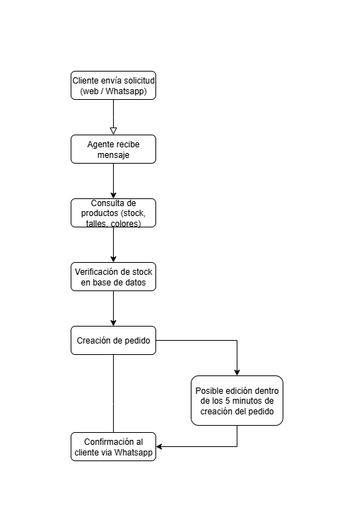
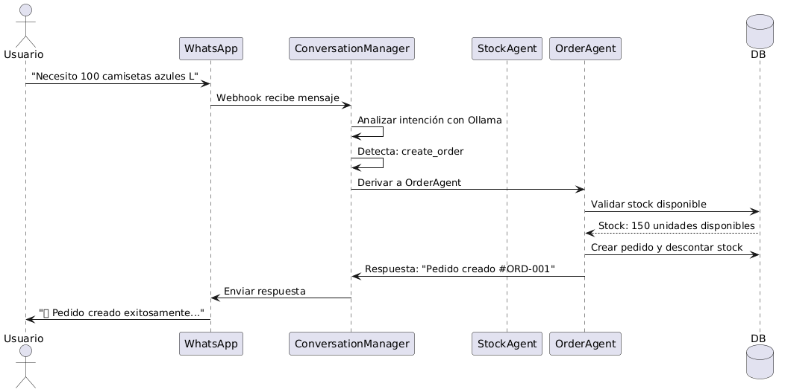

# 📊 Análisis y Planificación

## 🔄 Diagrama

## 🤖 Plan de Implementación - Sistema Multiagente

### 🎯 Arquitectura Elegida: **Agentes Especializados**

#### ¿Por qué esta arquitectura?

1. **Separación de responsabilidades** - Cada agente tiene un dominio específico
2. **Escalabilidad** - Fácil agregar nuevos agentes sin afectar existentes
3. **Mantenibilidad** - Código modular y testeable independientemente
4. **Robustez** - Si un agente falla, los demás siguen funcionando
5. **Especialización** - Cada agente optimizado para su tarea específica

### 🧠 Agentes Implementados

#### 1. **ConversationManager** 🎯 (Router Central)

**Responsabilidad:** Análisis de intención y derivación inteligente

- Analiza mensaje del usuario con contexto conversacional
- Detecta intención (check_stock, create_order, modify_order, etc.)
- Mantiene historial de conversación en memoria y BD
- Deriva al agente especializado apropiado

**Beneficio IA:** Comprende contexto ("y en azul?" recordará producto anterior)

#### 2. **StockAgent** 📦 (Especialista en Inventario)

**Responsabilidad:** Consultas inteligentes de stock

- Filtra por tipo, color, talla simultáneamente
- Respuestas organizadas por categorías (Formal, Casual, Deportivo)
- Detección de variaciones ("pantalón"/"pantalones")
- Sugerencias automáticas cuando no hay stock

**Beneficio IA:** Comprende consultas naturales y ofrece alternativas relevantes

#### 3. **OrderAgent** 🛒 (Especialista en generar pedidos)

**Responsabilidad:** Gestión completa de pedidos

- Validación de stock en tiempo real
- Cálculo automático de precios por volumen (50+, 100+, 200+)
- Descuento automático de stock al confirmar
- Generación de resúmenes detallados

**Beneficio IA:** Maneja lógica de negocio compleja automáticamente

#### 4. **ModifyAgent** ✏️ (Especialista en modificar pedidos)

**Responsabilidad:** Edición de pedidos con restricciones temporales

- Validación de ventana de 5 minutos
- Gestión bidireccional de stock (devolver/descontar)
- Recálculo automático de precios
- Historial de cambios

**Beneficio IA:** Aplica reglas de negocio complejas automáticamente

#### 5. **SalesAgent** 💡 (Asesor Comercial)

**Responsabilidad:** Consultoría y recomendaciones

- Asesoramiento por sector empresarial
- Optimización de costos por volumen
- Recomendaciones de productos complementarios
- Seguimiento de oportunidades

**Beneficio IA:** Actúa como consultor experto disponible 24/7

#### 6. **GeneralChatAgent** 💬 (Soporte General)

**Responsabilidad:** Conversación natural y soporte

- Manejo de saludos y conversación casual
- Presentación de empresa y servicios
- Derivación inteligente a otros agentes
- Mantenimiento de engagement

**Beneficio IA:** Crea experiencia conversacional natural y humana

### 🔄 Flujo de Procesamiento

### 🎯 Ventajas del Sistema Implementado

#### **Para el Negocio:**

- ✅ **Disponibilidad 24/7** - Atención sin límites horarios
- ✅ **Escalabilidad infinita** - Múltiples conversaciones simultáneas
- ✅ **Reducción de errores** - Validaciones automáticas
- ✅ **Trazabilidad completa** - Historial de todas las transacciones
- ✅ **Optimización de costos** - Automatización del proceso de ventas

#### **Para los Clientes:**

- ✅ **Respuesta instantánea** - Sin esperas ni colas
- ✅ **Interfaz familiar** - WhatsApp que ya conocen
- ✅ **Información precisa** - Stock en tiempo real
- ✅ **Proceso simplificado** - De consulta a pedido en minutos
- ✅ **Flexibilidad** - Modificaciones rápidas permitidas

#### **Para el Desarrollo:**

- ✅ **Modularidad** - Fácil mantener y extender
- ✅ **Testabilidad** - Cada agente testeable independientemente
- ✅ **Robustez** - Fallbacks automáticos si un componente falla
- ✅ **Monitoreo** - Logs detallados de cada agente
- ✅ **Evolución** - Fácil agregar nuevos agentes sin afectar existentes

### 🚀 Escalabilidad Futura

#### **Nuevos Agentes Propuestos:**

- **InventoryAgent** - Alertas automáticas de stock bajo
- **ReportingAgent** - Informes automáticos de ventas
- **CustomerAgent** - Gestión de perfil y historial de clientes
- **LogisticsAgent** - Seguimiento de envíos y entregas
- **MarketingAgent** - Campañas personalizadas por segmento

## 🎯 Conclusión

La implementación de este **sistema multiagente especializado** transforma completamente el proceso tradicional de ventas B2B, automatizando desde la consulta inicial hasta la confirmación del pedido, mientras mantiene la flexibilidad y personalización que requieren los clientes empresariales.

La **arquitectura elegida garantiza escalabilidad, mantenibilidad y robustez**, estableciendo una base sólida para el crecimiento futuro del negocio.
